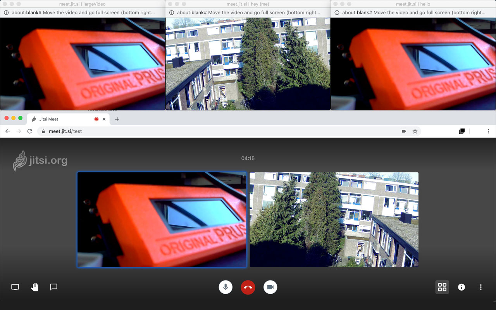

# Pop-up Videos 

Opens all the videos in a tab as pop-up windows, and keeps opening windows when new videos appear. You can drag the windows around to put them on different monitors, for example. It also comes in handy when you want to capture (multiple) videos from a web page to use in other programs, like [OBS Studio](https://obsproject.com).

## Download

Get [Pop-up Videos](https://chrome.google.com/webstore/detail/babkffilagdlhoeopgfnhfnomhicjodj/) from the Chrome Web Store.

## Pop-out Jitsi Meet

Also check out my [Pop-out Jitsi Meet](https://github.com/Jip-Hop/jitsi-pop) extension, which does what this extension does (+ more) and is made specifically for [Jitsi Meet](https://meet.jit.si).

## Use case scenario:

- Open a Jitsi Meet video conference on: https://meet.jit.si/.
- Click the black extension icon in the browser toolbar (top right), and click enable.
- The tab will open in its own window, to ensure videos continue to play even in the background.
- Pop-ups will open for all videos in the conference page.
- You can move some of the videos to a different monitor and make them full screen, and close the others you don't need.
- Use [OBS Studio](https://obsproject.com) to grab the full screen video, and use it in your live stream.
- During the live stream, you can still use the Jitsi Meet interface as usual without it appearing in the window capture from OBS Studio.

## Remarks:

- If you want to full screen the pop-up window, do it on another monitor. Not on the monitor where the 'source' tab is displayed. Otherwise the video may stop playing.
- Once enabled, the source tab needs to remain the only tab in its window. You can't drag any tabs into the window, and all new tabs made in that window will be opened in new windows as well. This behaviour goes back to normal when you disable the extension for this tab.
